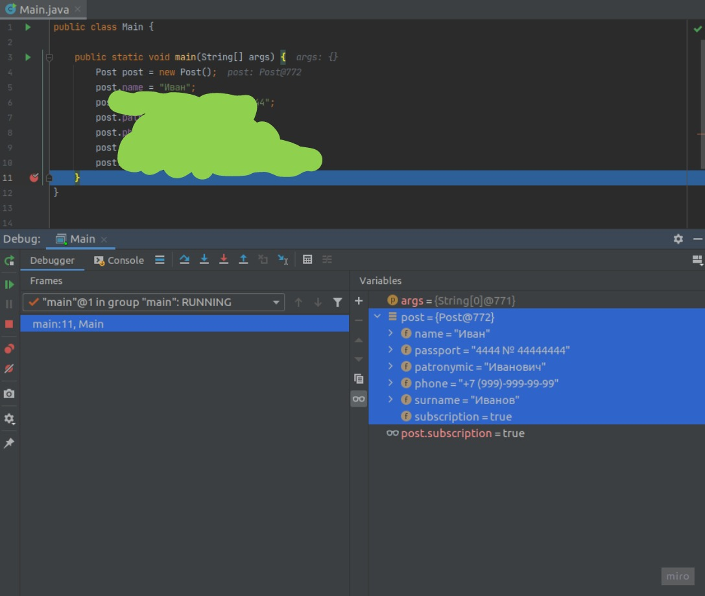

## Задание 1 (обязательное)

В этой задаче, в отличие от всех последующих, настраивать CI не требуется.

Вспомните условие задачи из курса по ручному тестированию, где вы общались с сервером. Тогда на сервер вы посылали
информацию в виде JSON — текстового формата описания объекта в JavaScript-стиле, выглядела она так:

````json
{
  "birthday": "13.06.1999",
  "name": "Иван",
  "passport": "4444 № 44444444",
  "patronymic": "Иванович",
  "phone": "+7 (999)-999-99-99",
  "surname": "Иванов"
}
````

Немного усложним и добавим в неё ещё информацию о том, согласен ли пользователь получать новости о скидках в виде
sms: `"subscription": true`.  
Также предлагается, чтобы дата рождения была не полем-строкой, а тоже
объектом: `"birthday": {"day" : 13, "month": 6, "year": 1999}`.  
В итоге объект в запросе будет выглядеть, например, так:

````json
{
  "birthday": {
    "day": 13,
    "month": 6,
    "year": 1999
  },
  "name": "Иван",
  "passport": "4444 № 44444444",
  "patronymic": "Иванович",
  "phone": "+7 (999)-999-99-99",
  "surname": "Иванов",
  "subscription": true
}
````

Вашей задачей будет разработать классы, описывающие объекты запроса анкеты на сервер, и продемонстрировать их работу
в `Main`.

Создайте класс `Post`, описывающий объект запроса на сервер, и заполните его полями. Сперва можно без `birthday`, так
как для него придётся создавать вспомогательный класс, выбрав подходящие типы:

````java
public class Post {
    public String name; // поле для имени
// добавьте другие поля
}
````

Создадим класс `Main`, в `main` которого создадим и заполним наш объект:

````java
public class Main {
    public static void main(String[] args) {
        Post post = new Post();
        post.name = "Иван";
// заполните другие поля
    }
}
````

Поставим точку останова на последней строчке, можно прямо на закрывающей фигурной скобке `main`, и запустим отладчик,
чтобы посмотреть, что у нас будет лежать в переменной с объектом:



Если вы сделали всё правильно, то в отладчике будет виден созданный и заполненный объект типа `Post` по схеме данных —
полей — указанных вами в классе `Post`.

Осталось добавить поле `birthday`. Значение в этом поле должно быть объектом, для которого также нужно будет создать
свой класс. Создайте класс `FormDate` для описания схемы объекта в поле `birthday`:

````java
public class FormDate {
// добавьте три необходимых поля
}
````

Теперь в классе `Post` добавьте поле `birthday` с типом `FormDate`. После чего добавьте заполнение этого поля в `main`:

````java
post.birthday =new

FormDate();

post.birthday.day =13;
// заполните другие поля даты рождения
````

Запустите отладчик снова и убедитесь, что всё заполнено как надо и соответствует `JSON`-описанию объекта выше.

____________________________________

### Правила приема работы

Прикреплена одна ссылка на публичный репозиторий с решением задачи.
____________________________________

### Критерии оценки

1. В каждом репозитории размещено содержимое папки проекта IDEA. Корнем репозитория должна именно папка проекта - не
   папка `src`, не папка внутри которой лежит папка проекта; т.о. в корне репозитория должна лежать сразу папка `src`.
2. Есть файл `.gitignore`, игнорирующий ненужные файлы и папки, которые должны отсутствовать в репозитории. Если они
   присутствуют - их нужно оттуда удалить.
3. Программа соответствует всем требованиям из условия задачи
4. рограмма использует только те инструменты языка, которые мы проходили или которые прямо разрешены условием задачи
5. Программа работает правильно на всех примерах из условия
6. Программный код отформатирован и соответствует пройденным требованиям к качеству кода
7. Программа спроектирована достаточно логично и правильно, не противоречит общепринятым в производстве практикам и
   традициям
8. При наличии недочётов, в зависимости от их серьёзности и количества, работа может быть отправлена на доработку или
   принята; решение принимается на основе экспертной оценки работы.